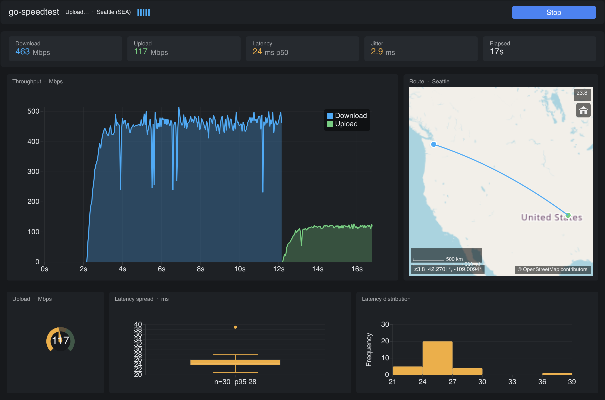

# go-speedtest

A network speed test with a live dashboard. It is also the demonstration app for
three libraries that work together: [go-gui] for the window, layout and
animation, [go-charts] for the charts, and [go-map] for the map.



## What it shows

The dashboard has four parts:

- **Throughput.** A sliding area chart. Download and upload are drawn on one
  timeline, so you can compare them.
- **Route.** A map with two pins. One pin is your approximate location. The
  other is the Cloudflare datacenter that answered. A great-circle line joins
  them.
- **Latency spread.** A box and whisker plot of the round-trip times. The dots
  outside the whiskers are the stalls that an average hides.
- **Latency distribution.** A histogram of the same samples. One narrow peak is
  a healthy link. A second peak to the right is a busy queue.

## Install and run

You need Go 1.26 or later.

```
go run ./cmd/go-speedtest
```

The window opens. Click **Start test**.

## Command-line options

| Flag                        | What it does                                   |
| --------------------------- | ---------------------------------------------- |
| `-demo`                     | Use the offline generator. No network.         |
| `-start`                    | Start a run as soon as the window opens.       |
| `-once`                     | Run one test, print a text report, and exit.   |
| `-screenshot <path>`        | Render one frame to a PNG file and exit.       |
| `-screenshot-at <duration>` | How far into the run to capture. Default 9s.   |
| `-timeout <duration>`       | Give up on a run after this long. Default 90s. |

To see the app with no network, run this command:

```
go run ./cmd/go-speedtest -demo -start
```

To get numbers without a window, run this command:

```
go run ./cmd/go-speedtest -once
```

## How it measures

The app calls three endpoints at `speed.cloudflare.com`:

- `/cdn-cgi/trace` gives the datacenter code, your country code, and your public
  IP address.
- `/__down?bytes=N` gives the download payload.
- `/__up` accepts the upload payload.

Both directions move about 36 MB, in four stages that increase in size. The
early stages warm the connection while the chart already has something to draw.

**The headline download number is the 90th percentile of the instantaneous
readings, not the mean.** The first second of a transfer is TCP slow start. An
average that includes it reports a speed the link never reached.

**The headline upload number comes from the largest completed stage, measured
end to end.** An upload rate measured on the client counts bytes given to the
kernel, not bytes the far end received. Socket buffers make the live readings
optimistic, so those readings drive the chart and nothing else.

The live upload readings are a running average over the phase, not a per-window
rate. A window measurement of a buffered write alternates between the speed of a
memory copy and zero, because the buffer accepts a burst and then blocks. On a
100 Mbit link that draws spikes above 700 Mbps between troughs at nothing.

**Jitter is the mean absolute difference between consecutive samples** (IPDV,
RFC 3393). It is not the standard deviation. A link that alternates between 10
ms and 50 ms every packet has the same standard deviation as one that drifts
slowly between them. The jitter is much worse.

## Privacy

The app does no geo-IP lookup. The client pin is the centroid of the country
code that the trace endpoint reports, and nothing more. Your IP address goes
nowhere except to the endpoints above, which already see it.

The map loads tiles from OpenStreetMap. This sends the map viewport to the
OpenStreetMap tile servers. Use `-demo` if you want a run that touches no
network at all.

## Limits

These endpoints are undocumented and can change. A failure stops the run and
shows an error in the title bar. It does not stop the app.

The datacenter table in `internal/probe/colo.go` is partial. Cloudflare runs in
more than 300 cities. An unknown code still prints, but the map skips that pin.

## Layout of the source

| Path               | Contents                                           |
| ------------------ | -------------------------------------------------- |
| `cmd/go-speedtest` | Flags, window, text report, screenshot mode.       |
| `internal/probe`   | The measurement engine. It imports no UI package.  |
| `internal/app`     | Window state, the view tree, the event pump.       |
| `internal/stats`   | Percentile, jitter, and other numeric helpers.     |
| `internal/format`  | Number formatting shared by the UI and the report. |

The split between `internal/probe` and `internal/app` is deliberate. Nothing in
`app` measures anything. Nothing in `probe` knows that a window exists. As a
result the engine tests run against an `httptest` server in milliseconds.

## Development

```
go test ./internal/...          # unit tests
go test -race ./internal/...    # the event pump is concurrent
golangci-lint run ./...         # lint
```

Set `GOGUI_DEBUG=1` when you run the app. The go-gui debug gate walks the view
tree each frame and reports duplicate widget IDs, focusable shapes with no ID,
and other identity faults to stderr.

Until go-charts and go-map publish tags under the `github.com/go-gui-org` module
path, this module builds from a local `go.work` file. See `go.work` for the
details.

## License

MIT. See [LICENSE](LICENSE).

[go-gui]: https://github.com/go-gui-org/go-gui
[go-charts]: https://github.com/go-gui-org/go-charts
[go-map]: https://github.com/go-gui-org/go-map
